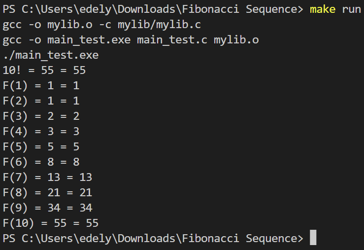

# Fibonacci Benchmark

The Fibonacci Sequence is a series of numbers that gradually increases. The next number is found by adding up the two numbers before it. For example, the first number is 0, then 1, another 1, and it will slowly increase.

There are two ways to calculate a Fibonacci Sequence. Iterative and Recursive.

## Iterative Method
```c
int fibonacciIterative(int N){
    // iterative method
    if (N ==0){
        return 0;
    } else if (N == 1){
        return 1;
    } else {
        int num1 = 0;
        int num2 = 1;
        int output;
        for (int i = 2; i <= N; i++){
            output = num1 + num2;
            num1 = num2;
            num2 = output;
        }
        return output;
    }
}
```

## Recursive Method
```c
int fibonacciRecursive(int N){
    // recursive method
    if (N == 0){
        return 0;
    } else if (N == 1){
        return 1;
    } else {
        return fibonacciRecursive(N-1) + fibonacciRecursive(N-2);
    }
}
```

## How to run
```sh
make run
./main_test.exe
```

## Output

